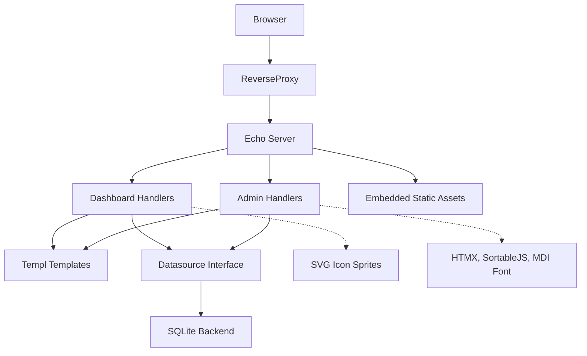

# Architecture

Technical details about how Jumpgate is built. For the reasoning behind these decisions, see [PHILOSOPHY.md](PHILOSOPHY.md).

## Dependencies

| Dependency | Why |
|-----------|-----|
| `github.com/labstack/echo/v5` | HTTP routing, middleware chaining, route grouping. Type-safe `PathParam[int]()` eliminates manual `strconv`. Runtime deps are `golang.org/x/net` and `golang.org/x/time` only. |
| `modernc.org/sqlite` | Pure Go SQLite driver for `database/sql`. No CGO — clean cross-compilation for ARM/Raspberry Pi. Single file DB, zero-config, no server process. |
| `github.com/a-h/templ` | Type-safe HTML templates compiled to Go functions. Components are functions — HTMX partial rendering is just calling a function. Struct field renames break at compile time, not runtime. |
| `gopkg.in/yaml.v3` | YAML parsing for config import/export. |

## Component Overview



## Request Flow

1. Browser → Reverse Proxy (sets `X-Authorized-User` header)
2. Reverse Proxy → Jumpgate (port 8080)
3. Dashboard routes (`/`, `/set-theme`) are public
4. Admin routes (`/admin/*`) pass through `requireAuth` middleware — returns 401 if no auth header
5. Handler calls `Datasource` method to read/write DB
6. Handler renders Templ component to HTML
7. HTML returned to browser (full page or HTMX fragment)

## Security Model

- **Authentication** — Delegated to reverse proxy (Authelia, OAuth2 Proxy, etc). Proxy sets `X-Authorized-User`, `X-User`, or `X-Remote-User` header. No auth header = 401 on admin, private content hidden on dashboard.

- **CSRF Protection** — HTMX sends custom `HX-Request` header. Browsers block custom headers on cross-origin requests without CORS preflight. No CSRF token needed.

- **XSS Protection** — Templ auto-escapes all template variables. HTML is never constructed via string concatenation.

- **SQL Injection** — All queries use parameterized statements via `database/sql`. Update methods build SQL from typed structs, not raw strings.

- **Default Private** — New categories and bookmarks inherit `private=true` from global settings. Explicit toggle required to make public.

## Datasource Interface

The `Datasource` interface in `storage/db.go` defines the storage contract. All handlers operate on the interface, not a concrete type. New backends implement this interface. SQLite is the current backend, wired in `cmd/jumpgate/main.go`.

## Database Schema

Tables in SQLite:

**schema_version** — Single-row table tracking migration version.

**settings** — Single-row table (CHECK `id = 1`) with global configuration: title, weather coords/unit/cache, default_private, default_open_in_new_tab.

**categories** — `id`, `name`, `position`, `enabled`, `private` (nullable), `is_favorites` (unique index ensures only one). Foreign key target for bookmarks.

**bookmarks** — `id`, `category_id` (FK with CASCADE delete), `name`, `url`, `mobile_url`, `icon`, `enabled`, `open_in_new_tab` (nullable), `private` (nullable), `position`, `keywords`.

SQLite pragmas: WAL mode (concurrent reads), foreign keys enabled, MaxOpenConns=1 (serialized writes).

Migrations tracked via `schema_version.version`, applied sequentially by `migrateSchema()`.

### Typed IDs

```go
type CategoryID int
type BookmarkID int
```

Prevents accidentally passing a bookmark ID where a category ID is expected. Compiler enforces correctness.

### Three-State Booleans

Nullable boolean fields (`*bool`) support inheritance:

- `nil` = inherit from global default (`settings.default_private`)
- `true` = explicitly on
- `false` = explicitly off

Toggle cycling: `nil → true → false → nil`

### Update Structs

Pointer fields distinguish "not sent" from "set to this value":

```go
type BookmarkUpdate struct {
    Name      *string  // nil = don't update, non-nil = set to this value
    URL       *string
    MobileURL *string
    Icon      *string
    Keywords  *string
}
```

HTMX auto-save sends only the changed field. `formStr()` checks for key presence in form data (not value emptiness), allowing users to clear fields to empty strings.

## Static Asset Embedding

`static/fs.go` uses `//go:embed` to embed CSS, JS, themes, and favicon into the binary. The `embed.FS` is served via Echo's `StaticFS` middleware. No runtime filesystem dependencies for static assets.

## Theme System

Themes are CSS files in `static/themes/`, discovered on each request by reading the embedded filesystem. Each theme defines these CSS custom properties:

- `--color-background`, `--color-primary`, `--color-accent`, `--color-hover`
- `--color-surface`, `--color-border`, `--color-danger`, `--color-success`

Theme selection stored in a cookie (`theme`, 1-year expiry, SameSite=Lax). Dashboard and admin share the same theme.

## Cache Busting

`fileHash()` computes MD5 from `embed.FS` file content, caches in `sync.Map`, returns first 8 hex chars. URLs include `?v={hash}` for automatic cache invalidation.

Theme hashes are pre-computed for all themes and injected into the page as `window.THEME_HASHES` JSON, enabling client-side theme switching with correct cache busting.

## Dashboard

The dashboard is designed to load and render fast. Zero third-party dependencies — only embedded CSS, JS, and SVG sprites.

### Client-Side JavaScript

JS is used only where a server round-trip would be impractical:

- **Search** — Data is already on the page; filtering in-memory is instant vs. a network round-trip per keystroke.
- **Theme switching** — Stylesheet swap and transition are browser-side concerns.
- **Weather geolocation** — Browser geolocation API sets cookies for server-side weather fetch.

### Icons

SVG sprites fetched from the MaterialDesign-SVG GitHub repo, cached to `data/icons/*.svg`, converted to `<symbol>` elements inline in the HTML. Only icons actually used on the current page are included.

## Admin

The admin panel uses third-party libraries (loaded from CDN) for usability — HTMX for server-driven interactivity, SortableJS for drag-and-drop, MDI web font for icons.

### Third-Party Dependencies

| Asset | Why |
|-------|-----|
| HTMX | Server-driven interactivity without custom JS. Auto-save on change via `hx-put`, toggle cycling via `hx-post`, creates/deletes swap HTML fragments. |
| SortableJS | Drag-and-drop reordering. HTMX has no drag capability. SortableJS handles the drag UI, calls `htmx.ajax()` on drop to persist order. |
| MDI Web Font | Icon font for admin UI controls (drag handle, delete, duplicate, sort, toggle icons). Server-side search. |

### HTMX Patterns

- **Auto-save** — `hx-put` with `hx-trigger="change"` and `hx-swap="none"`. Fields save immediately on change.
- **Toggle cycling** — `hx-post` to toggle endpoint, server returns updated toggle button HTML. OOB swaps update inherited items that change as a result.
- **Create** — `hx-post` returns new item HTML, swapped into the list.
- **Delete** — Custom confirm dialog triggers `confirmed` event, then `hx-delete` with `hx-swap="delete"` removes the element.
- **Reorder** — SortableJS `onEnd` calls `htmx.ajax()` with JSON array of IDs to persist new order.
- **Move bookmark** — SortableJS cross-list drag calls `htmx.ajax()` POST to move endpoint with target category and position.

### Client-Side JavaScript

- **Accordion** — Toggling edit row visibility is pure DOM show/hide; a server request to change CSS display is wasteful.
- **Search filtering** — Data is already on the page; filtering in-memory is instant vs. a network round-trip per keystroke.
- **HTMX feedback handlers** — Visual feedback for async operations (save success, errors) is inherently a client-side concern.

Everything else goes through HTMX and server rendering: CRUD, toggles, icon search, creates, deletes, reordering persistence.

### Icons

MDI web font loaded from CDN. Icon font classes (`mdi mdi-*`) for admin UI controls. Full icon list fetched from CDN metadata at startup, cached to `data/icons.txt`. Server-side search returns up to 50 matches for the icon picker.
